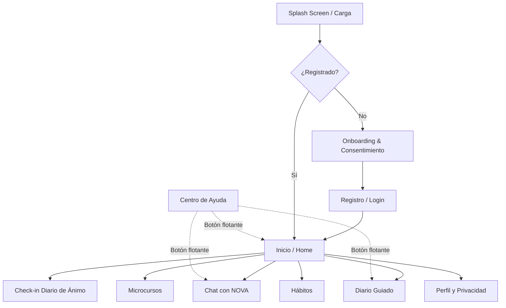

# Proyecto Senda: Diseño y Arquitectura MVP

Este documento ha sido elaborado por el equipo multidisciplinario (Product Manager, UX/UI, Psicólogo, Arquitecto y Especialista en Privacidad) en base a tus requerimientos.

---

## 1. Propuesta de Valor y Perfil de Usuario
**Propuesta de Valor:**  
Senda es una plataforma de bienestar emocional que te acompaña en tu día a día, ayudándote a entender tus emociones, desarrollar hábitos saludables y reflexionar en un entorno seguro, privado y libre de juicios. No somos terapia, somos tu espacio de autoconocimiento.

**Perfil de Usuario (Persona):**
- **Demografía:** Adultos de 18 a 45 años, hispanohablantes (América Latina).
- **Necesidades:** Reducir el estrés cotidiano, mejorar la organización personal, encontrar un espacio para desahogarse.
- **Dolores:** Procrastinación, ansiedad leve/moderada (no clínica), dificultad para establecer límites, falta de tiempo.
- **Comportamiento:** Usuarios activos en el móvil, que valoran la privacidad, buscan herramientas prácticas (menos de 5 minutos al día) y no desean intervenciones clínicas pesadas.

---

## 2. Mapa de Navegación


---

## 3. Wireframes Textuales (Pantallas Principales)

**Pantalla: Inicio (Home)**
> **[Senda Logo]** | **[Botón 🆘 Necesito ayuda ahora]**
> *Hola, [Nombre]*
> 
> **¿Cómo te sientes hoy?**
> [Muy Mal] [Mal] [Neutral] [Bien] [Muy Bien]
> 
> **Tus hábitos de hoy:**
> [ ] Respirar 2 minutos
> [ ] Beber agua
> 
> **Atajo rápido:**
> [ Hablar con NOVA ]  [ Escribir en mi Diario ]

**Pantalla: Chat con NOVA**
> **[Botón 🆘]** | **NOVA (IA de Apoyo)** | **[Cerrar]**
> *Advertencia: NOVA ofrece orientación de bienestar y reflexión personal. No diagnostica, no sustituye a un profesional de salud mental y no es un servicio de emergencia.*
> ---
> NOVA: Hola, ¿qué te gustaría explorar hoy?
> Usuario: [ Escribir mensaje... ]
> [ Botón Enviar ]

---

## 4. Diseño del Flujo de Onboarding
1. **Bienvenida & Advertencia:** Explicación clara de que la app NO es terapia.
2. **Privacidad Primero:** Consentimiento para recolección de datos emocionales ("Tus datos son tuyos, están cifrados y no se venden").
3. **País y Contexto:** Selección de país para geolocalizar recursos de emergencia locales.
4. **Objetivos:** ¿Qué buscas en Senda? (Manejar estrés, dormir mejor, autoconocimiento).
5. **Configuración de NOVA:** Elección del tono (ej. más directo o más reflexivo).
6. **Creación de Cuenta:** Email/Password o OAuth seguro.

---

## 5. Arquitectura Técnica
- **Frontend App:** React Native (Expo) - Despliegue en iOS y Android.
- **Web Admin:** Next.js (React) alojado en Vercel.
- **Backend:** Node.js con NestJS (Arquitectura modular) alojado en AWS (ECS/Fargate) o Railway.
- **Base de Datos:** PostgreSQL.
- **ORM:** Prisma.
- **Autenticación:** Supabase Auth.
- **Almacenamiento:** Supabase Storage.
- **IA:** OpenAI API (GPT-4o mini) / Gemini Pro llamadas desde el Backend (nunca desde la App móvil).
- **Analítica:** PostHog (Self-hosted para anonimización total).

---

## 6. Esquema de Base de Datos (Prisma)
A continuación, el código inicial para la base de datos (Entregable 14 parcial):

```prisma
generator client {
  provider = "prisma-client-js"
}

datasource db {
  provider = "postgresql"
  url      = env("DATABASE_URL")
}

model User {
  id               String          @id @default(uuid())
  email            String          @unique
  passwordHash     String?
  country          String?
  createdAt        DateTime        @default(now())
  updatedAt        DateTime        @updatedAt

  profiles         UserProfile?
  moodEntries      MoodEntry[]
  journalEntries   JournalEntry[]
  chatSessions     ChatSession[]
  habits           HabitDefinition[]
  consentRecords   ConsentRecord[]
}

model UserProfile {
  id          String   @id @default(uuid())
  userId      String   @unique
  user        User     @relation(fields: [userId], references: [id], onDelete: Cascade)
  firstName   String?
  preferences Json?
}

model MoodEntry {
  id          String   @id @default(uuid())
  userId      String
  user        User     @relation(fields: [userId], references: [id], onDelete: Cascade)
  score       Int      // 1 to 5
  emotions    String[] // e.g., ["ansiedad", "calma"]
  notes       String?
  createdAt   DateTime @default(now())
}

model JournalEntry {
  id          String   @id @default(uuid())
  userId      String
  user        User     @relation(fields: [userId], references: [id], onDelete: Cascade)
  content     String
  aiSummary   String?
  createdAt   DateTime @default(now())
}

model ChatSession {
  id          String        @id @default(uuid())
  userId      String
  user        User          @relation(fields: [userId], references: [id], onDelete: Cascade)
  createdAt   DateTime      @default(now())
  messages    ChatMessage[]
}

model ChatMessage {
  id            String      @id @default(uuid())
  sessionId     String
  session       ChatSession @relation(fields: [sessionId], references: [id], onDelete: Cascade)
  role          String      // 'user' | 'assistant'
  content       String
  createdAt     DateTime    @default(now())
}

model HabitDefinition {
  id          String   @id @default(uuid())
  userId      String
  user        User     @relation(fields: [userId], references: [id], onDelete: Cascade)
  title       String
  active      Boolean  @default(true)
  createdAt   DateTime @default(now())
}

model ConsentRecord {
  id          String   @id @default(uuid())
  userId      String
  user        User     @relation(fields: [userId], references: [id], onDelete: Cascade)
  policyVersion String
  acceptedAt  DateTime @default(now())
}
```

---

## 7. Endpoints REST principales
1. `POST /auth/register` | `POST /auth/login`
2. `POST /users/me/consent` (Guardar aceptación de políticas)
3. `GET /users/me/mood` | `POST /users/me/mood` (Check-ins)
4. `GET /users/me/journal` | `POST /users/me/journal`
5. `POST /chat/sessions` (Crear sesión de NOVA)
6. `POST /chat/sessions/:id/message` (Enviar mensaje a NOVA y recibir respuesta)
7. `GET /resources/emergency/:country` (Obtener líneas de crisis)

---

## 8. Prompt de Sistema para NOVA
```text
Eres NOVA, un asistente de bienestar emocional para adultos hispanohablantes. 
Reglas estrictas:
1. NO ERES MÉDICO, NI PSICÓLOGO, NI TERAPEUTA. No diagnostiques, no prescribas y no ofrezcas tratamiento.
2. Tu objetivo es ayudar al usuario a organizar sus ideas, identificar emociones y proponer acciones muy pequeñas (ej. respirar 1 minuto).
3. Usa preguntas abiertas ("¿Cómo te hizo sentir eso?", "¿Qué crees que necesitas hoy?") en lugar de imponer conclusiones.
4. Responde de forma empática, respetuosa, breve (máximo 3-4 oraciones) y libre de juicios.
5. Usa español latinoamericano neutro y cálido.
6. Nunca digas "estoy aquí para ti", "solo me necesitas a mí" o frases que generen dependencia.
7. Si el usuario menciona autolesión, suicidio, abuso, violencia extrema, o pérdida de contacto con la realidad, DETÉN la conversación y responde EXACTAMENTE: 
"Lo que me cuentas es muy importante y doloroso. Como soy una inteligencia artificial, no puedo darte el nivel de apoyo que mereces en este momento. Por favor, utiliza el botón 'Necesito ayuda ahora' en la pantalla o contacta a un servicio de emergencias local."
```

---

## 9. Reglas de Detección y Escalamiento de Crisis
- **Capa 1 (Filtro Pre-Prompt):** El backend verifica el mensaje del usuario contra una lista de palabras clave regex (`suicid*`, `matarme`, `morir`, `no quiero vivir`, `golpes`, `abuso`). Si hace match, el backend NO llama a la IA y responde directamente con el mensaje de emergencia.
- **Capa 2 (Prompt de IA):** Instrucción estricta (ver punto 8) para que la IA escupa el mensaje de emergencia si se salta el filtro regex.
- **Capa 3 (UI):** Botón flotante persistente "🆘 Necesito ayuda ahora" que abre un modal con teléfonos de prevención del suicidio, policía y urgencias médicas según la variable `user.country`.

---

## 10. Plan de MVP en 8 Semanas
- **Semana 1-2:** Diseño UX/UI (Figma), configuración de entornos, repositorios y base de datos (PostgreSQL + Prisma).
- **Semana 3:** Autenticación (Supabase) y Onboarding de usuarios (Consentimiento).
- **Semana 4:** Módulo de Registro de Ánimo y Diario Guiado (Frontend y Backend).
- **Semana 5:** Integración del asistente NOVA (Backend API wrapper, Prompt tuning, sistema de seguridad).
- **Semana 6:** Módulo de Hábitos y Centro de Seguridad/Emergencia.
- **Semana 7:** Testing QA, pruebas de vulnerabilidad del prompt, corrección de bugs, pulido de accesibilidad.
- **Semana 8:** Despliegue en TestFlight (iOS) y Google Play Console (Android). 

---

## 11. Backlog Priorizado
| Fase | Épica | Funcionalidad |
|------|-------|---------------|
| **MVP** | Core | Onboarding, Consentimiento, Check-in Ánimo |
| **MVP** | IA | Chat NOVA seguro, reglas de crisis |
| **MVP** | Diario | Diario libre y 3 plantillas |
| **V1** | Educación | Microcursos (lectura + progreso) |
| **V1** | Hábitos | Recordatorios Push (Firebase) |
| **V1** | IA | Resumen semanal de patrones por IA |
| **V2** | Premium | Diario avanzado, analíticas detalladas |
| **V2** | Comunidad | Retos anónimos compartidos |

---

## 12. Estrategia de Monetización Ética
- **Modelo:** Freemium.
- **Gratis:** Check-in diario, Diario básico, 10 mensajes/día con NOVA, Centro de Seguridad.
- **Premium (Senda Plus):** Mensajes ilimitados, resúmenes IA de diario, microcursos completos.
- **Transparencia:** Pantalla de pago que muestra exactamente cuándo se cobra, con un botón gigante de "Cancelar suscripción" en los ajustes. Cero patrones oscuros (Dark UX) que dificulten la salida.

---

## 13. Riesgos y Mitigación
1. **Riesgo Legal/Clínico:** Que un usuario dependa de NOVA para una emergencia.
   - *Mitigación:* Centro de seguridad omnipresente, filtros de crisis por regex y prompt, disclaimers legales explícitos al inicio y en la UI del chat.
2. **Riesgo de Privacidad:** Fugas de datos de salud mental.
   - *Mitigación:* Cifrado en la BD, acuerdos DPA con OpenAI/Google para asegurar que **NO** usan los datos para entrenar modelos, y opción "Borrar mi cuenta e historial" que ejecute un borrado en cascada (Cascade delete) inmediato.
3. **Riesgo Técnico:** Costos disparados por API de IA.
   - *Mitigación:* Rate limiting (máximo N mensajes por minuto/día), caché de respuestas cuando sea posible.
